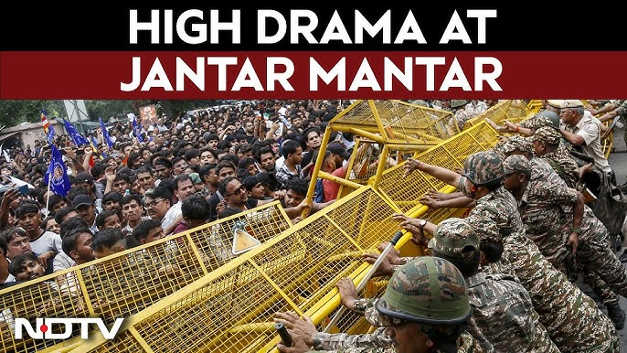

# Voice of Ladakh: A Cinematic Chronicle



**Voice of Ladakh** is an independent, interactive visual documentary chronicling the 2026 NEET-UG examination crisis, the youth-led protests at Jantar Mantar, and Sonam Wangchuk's 26-day hunger strike for institutional transparency and student welfare.

> **Disclaimer:** This independent documentary web project is curated by Shreesha Rao K and is **not affiliated** with the registered regional newspaper *The Voice of Ladakh* (est. 2013) or any government, political, or student party.

---

## 📖 Documentary Scope & Narrative

The chronicle is structured as a vertical, scene-based documentary cross-referenced against contemporaneous news reporting, judicial filings, and official government releases:

1. **The Epicenter (Jantar Mantar):** Ground zero for youth assemblies following the May 3, 2026 NEET-UG examination paper leak and its cancellation on May 12. Covers the origin of the student agitation initiated by the Cockroach Janta Party (CJP) under Abhijeet Dipke on June 6, joined on June 28 by Ladakhi reformer Sonam Wangchuk on an indefinite hunger strike.
2. **The Education Pioneer (Roots & Pedagogy):** Contextualizes Wangchuk's involvement through his 38-year history challenging centralized, unadapted schooling—highlighting his 1988 founding of SECMOL in response to widespread matriculation failures in Ladakh.
3. **Political Gridlock & Venue Dispute:** Parliamentary stalls, the demand for executive accountability, and student representatives' insistence on talks at a neutral public venue (Jantar Mantar or the Constitution Club) rather than ministerial residences.
4. **Tear Gas & Barricades (Escalation Timeline):**
   - **July 18 (Day 21):** Early morning police intervention at Jantar Mantar under Section 163 prohibitory regulations shifting Wangchuk to Safdarjung Hospital.
   - **July 20:** The "Chalo Sansad" student march, police lathi charges, tear gas deployment, barricades, and Central Delhi mobile internet suspension.
   - **July 21–23:** Delhi High Court order granting transfer to Medanta Hospital on a petition by Gitanjali Angmo; Prime Minister Narendra Modi's proposal of designated fast-track courts at Rouse Avenue.
   - **July 23:** Formal conclusion of the 26-day fast at Medanta Hospital with Union Ministers present, following an appeal signed by 65 MPs and written government commitments.
5. **A National & Global Echo:** University solidarity demonstrations across Patna, Kota, Hyderabad, and Bengaluru, alongside international coverage on competitive examination security.
6. **Resignation & Resolution:**
   - **July 25:** Resignation of Union Education Minister Dharmendra Pradhan, with Cabinet Minister Pralhad Joshi assigned additional charge of the portfolio.
   - **July 28:** CBI chargesheet filed naming 13 individuals in connection with examination paper distribution and translation breaches.
7. **Sources & Methodology:** Dedicated documentation matrix with 8 cross-referenced primary sources (*The Indian Express*, *Reuters*, *Al Jazeera*, *The Wire*, *Scroll*, *SECMOL*, *Rashtrapati Bhavan Communiqués*, and *CBI Bulletins*).

---

## 🛠️ Tech Stack & Architecture

- **Zero-Dependency Static Architecture:** Deployed purely as static HTML5, CSS3, and modern JavaScript on Vercel's Edge CDN. No Node/Express serverless function cold starts.
- **Self-Hosted Vendor Libraries:** GSAP, ScrollTrigger, SplitType, and Lenis are self-hosted under `src/vendor/`, eliminating third-party CDN latency, SRI mismatches, and unpkg availability risks.
- **Dual-Tier Asset Delivery:** Dedicated image sets optimized for mobile viewports (`src/phone/`) and desktop displays (`src/computer/`).
- **Web Audio API:** Procedural ambient sound synthesizer generating atmospheric drone harmonics with zero external audio assets.
- **Hardened Security & Headers:** Strict Content Security Policy (CSP), `X-Content-Type-Options: nosniff`, `X-Frame-Options: DENY`, `Referrer-Policy`, and asset cache headers configured via `vercel.json`.

---

## ♿ Accessibility & Performance

- **WCAG Accessibility:** 
  - Native `<noscript>` fallback delivering all documentary content and sources when JavaScript is disabled.
  - Full `@media (prefers-reduced-motion: reduce)` support disabling animations, Lenis momentum, and cursor effects.
  - Dialog semantics (`role="dialog"`, `aria-modal="true"`) with programmatic focus trapping and return-to-trigger restoration.
  - Unhijacked native keyboard scrolling (`ArrowUp` / `ArrowDown` scroll normally; `J` and `K` step through documentary chapters).
  - High-contrast `:focus-visible` rings on all interactive elements.

---

## 💻 Running Locally

This project is a 100% static web application. You can serve it with any local HTTP server:

```bash
# Clone the repository
git clone https://github.com/Shreesha-Rao-K/voice-of-ladakh.git
cd voice-of-ladakh

# Option A: Run with npx serve
npx serve .

# Option B: Run with Python 3
python -m http.server 3000
```
Open `http://localhost:3000` in your browser.

---

## ⚖️ License & Provenance

This repository uses a **Dual License** model:
- **Code:** Licensed under the [MIT License](LICENSE).
- **Documentary Text & Narrative Curation:** Licensed under [Creative Commons Attribution-NonCommercial 4.0 International (CC BY-NC 4.0)](LICENSE).
- **Media Assets & Quotes:** Incorporated under Fair Use / Fair Dealing principles for educational, archival, and documentary review.

---

## 📬 Corrections & Editorial Inquiries

To submit factual corrections, citation additions, or archival inquiries, please open an issue in the [GitHub Issue Tracker](https://github.com/Shreesha-Rao-K/voice-of-ladakh/issues).
